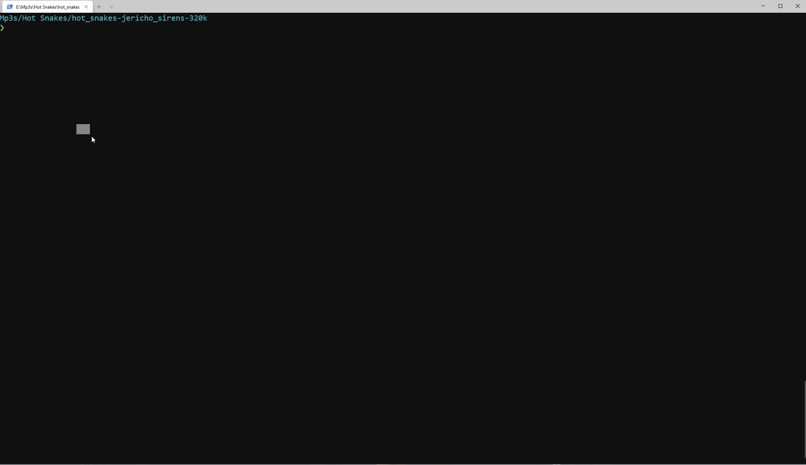

# nu_plugin_id3

The `id3` is a plugin for [nushell](https://www.nushell.sh) that helps you read the [id3](https://en.wikipedia.org/wiki/ID3) metadata of your mp3 files.
This is project is experimental and still under development.
The public API for the user (flags, command input, etc...) may change while [nushell](https://www.nushell.sh) is still pre `1.0`.



This project is still lacking many features
- Ability to parse Id3V1 tags
- Show tag version information
- Eliminate non-mp3 files from the output
- Missing several Id3V2 fields such as comments, data recorded, etc...
- Ability to write to the tag (mutate artist, album, comments, lyrics, etc...)
- Ability to convert from older Id3V1 to Id3V2.X
- Run `id3` command without `ls | get name` - check current directory or specify a directory in addition to `ls` support.

## Installation

This project depends on a minimum of [nushell](https://www.nushell.sh) `0.10.0` to be installed as that is when support for plugin names containing numbers started.

### Cargo
`cargo install nu_plugin_id3`

## Build from Source
- Clone this repository and navigate to the project directory
- `cargo install --path .`
- You may need to restart nushell for it to recognize this plugin.

## Usage

Nagivate to a directory that contains files with _id3_ tags.
The `id3` plugin expects a file path to parse from.
This is easiest to get by using the `ls` command in [nushell](https://www.nushell.sh).

```
ls | get name | id3
```

To take advantage of some fun features of [nushell](https://www.nushell.sh) like viewing images in your terminal,
you'll need to have the `binaryview` plugin installed with [nushell](https://www.nushell.sh).
You can install this via `cargo install nu_plugin_binaryview`. 
